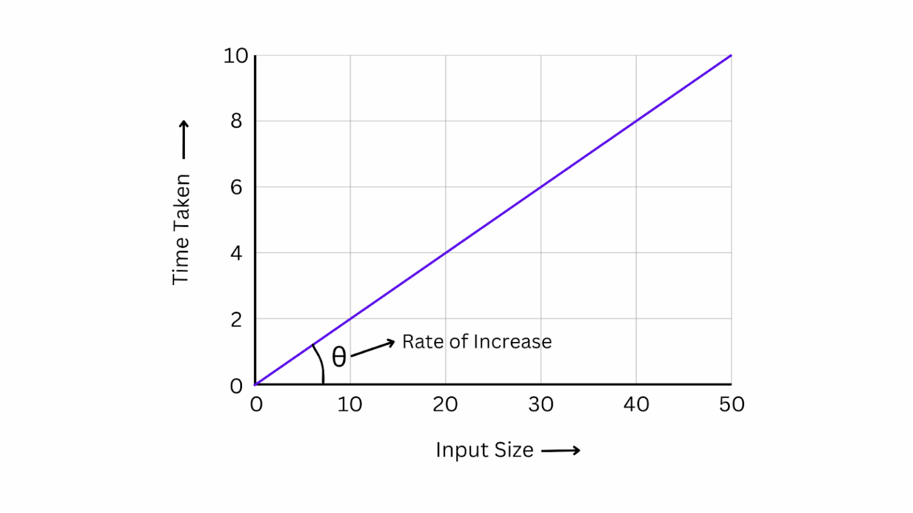

# 📘 Topic: Time Complexity and Space Complexity

- Time complexity and space complexity, both measure an algorithm’s efficiency. Where time complexity shows how the running time increases with input size. Space complexity tracks memory usage.

### Time Complexity

Time complexity measures how the time required to execute a code changes as the size of the input grows. It is independent of the machine used to execute the code & focuses solely on the algorithm’s behavior with increasing input size. This makes it a universal metric to compare algorithms.

## Rules :

- 1. Always calculate TC in terms of worst case
- 2. Avoid Constant Values
- 3. Avoid Lower values

## 🧮 Cases

### Time Complexity

- **Best Case:**- Omega
- **Average Case:** - Theta
- **Worst Case:** - Big - O

### Space Complexity

Space complexity refers to the amount of memory required by a program during its execution. This includes all the memory used by variables, data structures & any additional memory allocated while solving the problem.

# Space complexity is the sum of two components:

- Input Space: Memory required to store the input data
- Auxiliary Space: Additional memory required to solve the problem.
  Including temporary variables, data structures, or function call stacks.

